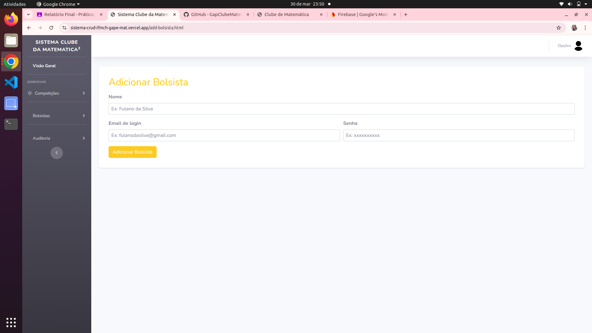
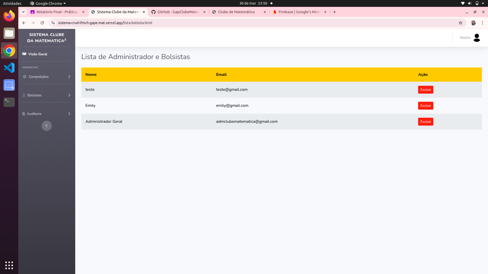
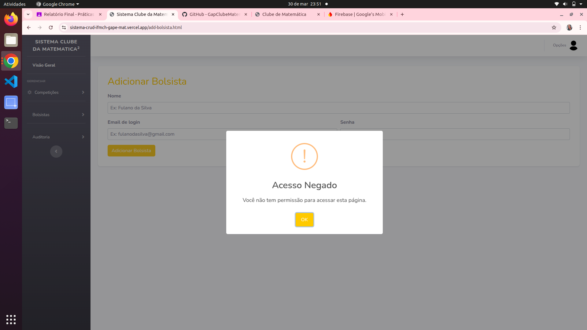
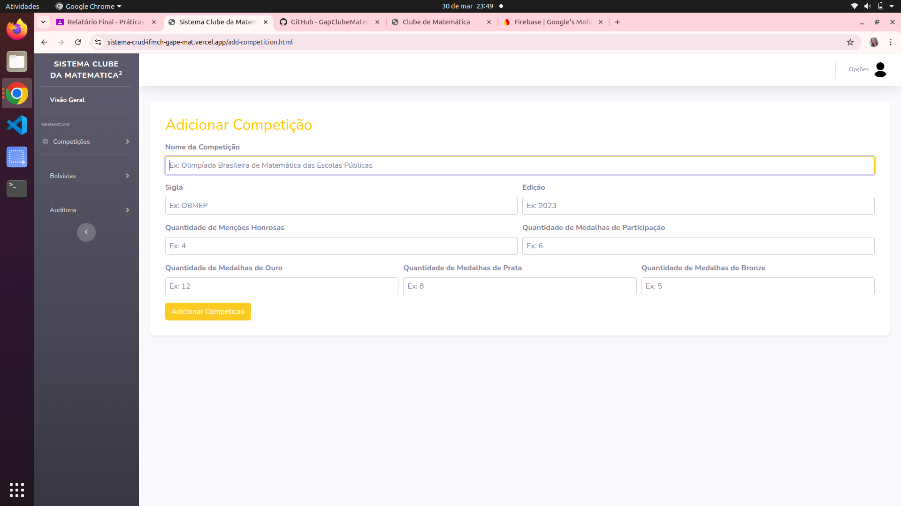
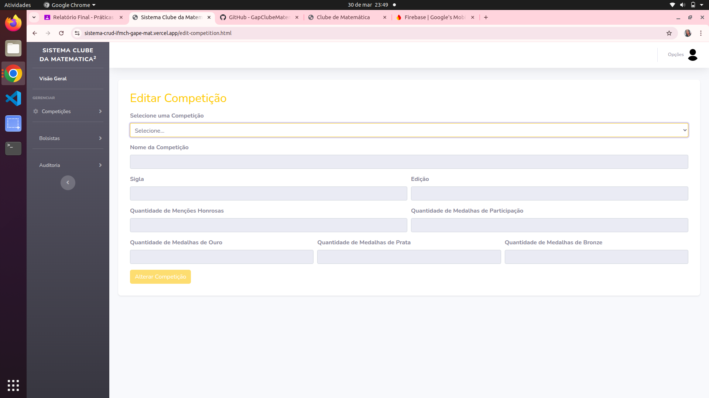
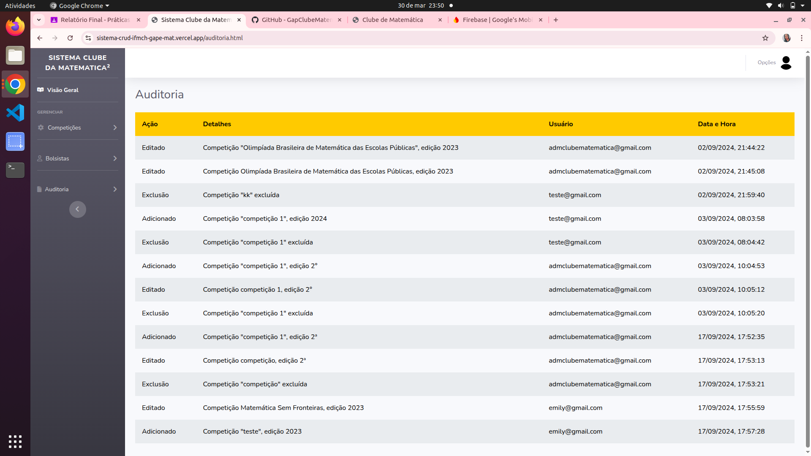
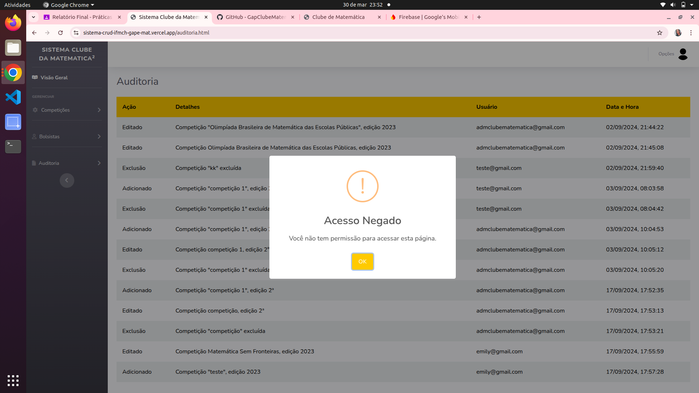
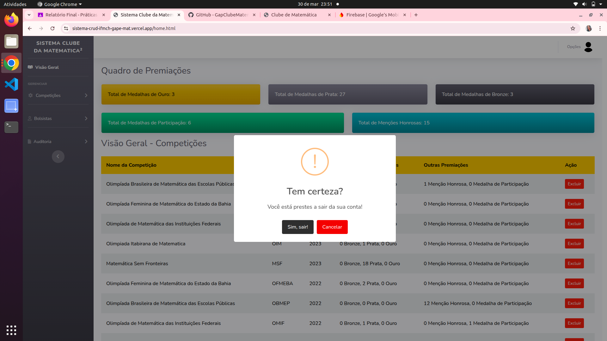

# 🎓 Sistema de Gerenciamento de Premiações  

Este sistema foi desenvolvido para gerenciar as premiações de matemática dos alunos do **Campus Machado** do **IFSULDEMINAS**. Ele permite cadastrar, visualizar e administrar as premiações de forma eficiente e organizada.  

## 🚀 Tecnologias Utilizadas  

- **HTML** → Estrutura da aplicação  
- **CSS** → Estilização e layout responsivo  
- **JavaScript** → Funcionalidades dinâmicas  
- **Firebase** → Banco de dados  

## 📌 Funcionalidades  

✔️ Cadastro e atualização de bolsistas(que podem acessar o site e atualizar informações)

✔️ Registro e atualização de premiações  

✔️ Listagem e consulta de premiações  

✔️ Auditoria das ações realizadas no site

## 🖥️ Tela de Login  

A aplicação conta com um **sistema de autenticação** que impede acessos não autorizados. A tela de login inclui:  

- **Validação de campos obrigatórios**  
- **Mensagem de erro para credenciais incorretas**

📸 **Tela de Login**  
  

## 🖥️ Tela Principal  

A aplicação conta com uma **visão geral intuitiva**, onde é possível:  

- Visualizar o **quadro de premiações**, exibindo o **total de premiações** e a **quantidade de cada colocação**.  
- Consultar a **lista de competições cadastradas**, com opções para **editar** ou **excluir** cada uma.  
- Navegar facilmente pelo **menu lateral**, que contém acessos rápidos para:  
  - **🏆 Competições**  
  - **🎓 Bolsistas**  
  - **📊 Auditoria**  

📸 **Tela Principal:**  
  

## 🎓 Gestão de Bolsistas  

A aplicação permite que **administradores** gerenciem os bolsistas de forma simples e eficiente.  

### 🔹 Funcionalidades disponíveis  

✔ **Adicionar Bolsista** → Cadastro de novos bolsistas no sistema.  
✔ **Excluir Bolsista** → Remoção de registros quando necessário.  

### 🛠️ Acesso restrito  

- Apenas **administradores** têm permissão para gerenciar os bolsistas.  
- Bolsistas não podem acessar essa área nem modificar dados.  

📸 **Tela de  Adicionar Bolsistas:**  
  

📸 **Tela de  Excluir Bolsistas:**  
  

📸 **Acesso negado para Bolsistas:**  
  

## 🏆 Gestão de Competições  

A aplicação permite que **tanto administradores quanto bolsistas** possam gerenciar as competições de forma intuitiva.  

### 🔹 Funcionalidades disponíveis  

✔ **Adicionar Competição** → Criar uma nova competição com nome, edição e outros detalhes.  
✔ **Editar Competição** → Atualizar informações já cadastradas.  
✔ **Excluir Competição** → Remover competições do sistema.  

### 👥 Permissões  

- **Administradores e bolsistas** podem **adicionar, editar e excluir** competições.  

📸 **Tela de Adicionar Competições:**  
  

📸 **Tela de Editar Competições:**  
  

## 📊 Auditoria do Sistema  

A auditoria registra todas as ações realizadas no sistema, garantindo **transparência e controle**.  

### 🔹 O que é registrado?  

✅ **Usuário responsável** (e-mail)  
✅ **Ação realizada** (exclusão, adição, edição)  
✅ **Data e hora exata** da ação  

### 🔒 Acesso Restrito  

- Apenas **administradores** podem visualizar os registros de auditoria.  
- A auditoria garante a **rastreabilidade** de todas as ações no sistema.  

📸 **Tela de Auditoria:**  
  

📸 **Tela de Auditoria: (Bolsista)**  
  

## 🔒 Sair do Sistema 

📸 **Tela de Saida**  
  
