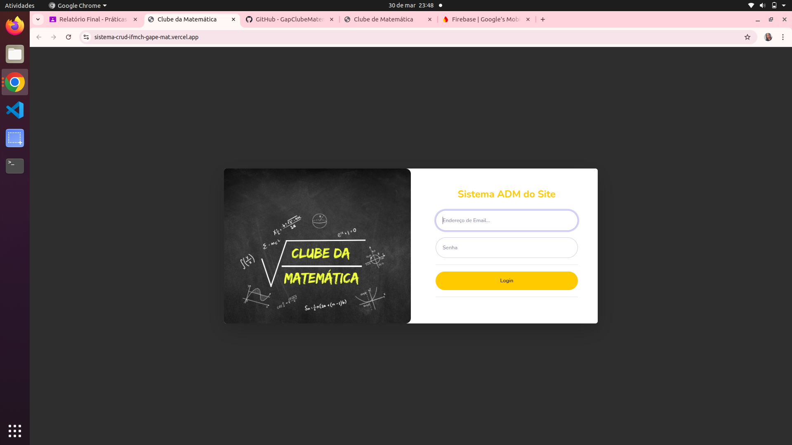
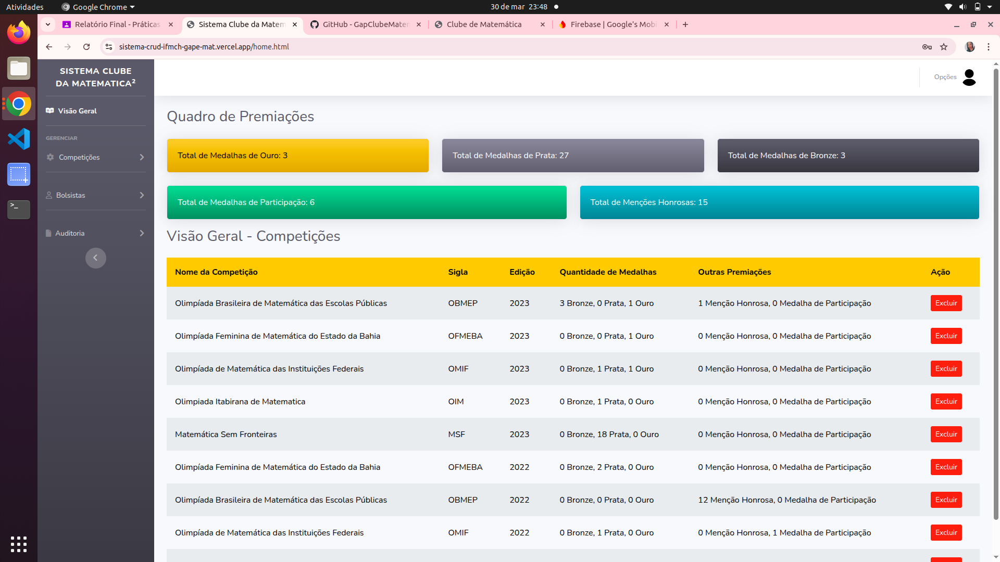

# 🎓 Sistema de Gerenciamento de Premiações  

Este sistema foi desenvolvido para gerenciar as premiações de matemática dos alunos do **Campus Machado** do **IFSULDEMINAS**. Ele permite cadastrar, visualizar e administrar as premiações de forma eficiente e organizada.  

## 🚀 Tecnologias Utilizadas  

- **HTML** → Estrutura da aplicação  
- **CSS** → Estilização e layout responsivo  
- **JavaScript** → Funcionalidades dinâmicas  
- **Firebase** → Banco de dados e autenticação  

## 📌 Funcionalidades  

✔️ Cadastro e atualização de bolsistas (que podem acessar o site e atualizar informações)
✔️ Registro e atualização de premiações  
✔️ Listagem e consulta de premiações  
✔️ Auditoria das ações realizadas no site

## 🖥️ Tela de Login  

A aplicação conta com um **sistema de autenticação** que impede acessos não autorizados. A tela de login inclui:  

- **Validação de campos obrigatórios**  
- **Mensagem de erro para credenciais incorretas**

📸 **Tela de Login**  
  

## 🖥️ Tela Principal  

A aplicação conta com uma **visão geral intuitiva**, onde é possível:  

- Visualizar o **quadro de premiações**, exibindo o **total de premiações** e a **quantidade de cada colocação**.  
- Consultar a **lista de competições cadastradas**, com opções para **editar** ou **excluir** cada uma.  
- Navegar facilmente pelo **menu lateral**, que contém acessos rápidos para:  
  - **🏆 Competições**  
  - **🎓 Bolsistas**  
  - **📊 Auditoria**  

📸 **Tela Principal:**  
  
